<!-- HEADER ANIMADO -->
<!-- 

  

-->
<h1 align="center">👋 Olá! Eu sou o Carlos</h1>
<h3 align="center">💻 Full Stack Developer | QA & Test Automation | Custom Software Development</h3>

---

## 🚀 Sobre mim
 
🔍 Buscando sempre escrever código limpo, organizado e escalável  

  
  
  

## 📊 Estatísticas

  <!-- 
   -->
  
  
  

  <!---->

---

## 🛠️ Tech Stack

### 💻 Linguagens

  

### 🎨 Front-end

  

### ⚙️ Back-end

  

### 🗄️ Banco de Dados

  

### 🧪 Testes

  

### 🤖 Automação e Dados

  

<!--
## 🐍 Contribuições

  

---
-->
