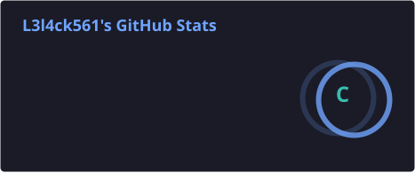
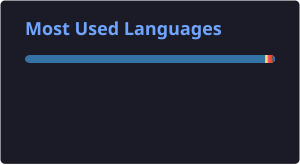

<!-- HEADER ANIMADO -->
<!-- 

  

-->
<h1 align="center">💪😎 Olá! Eu sou o Carlos</h1>
<h3 align="center">💻 Full Stack Developer | Software Engineering | Data Science / ML</h3>

---

### 🚀 Sobre mim
 
Apaixonado por criar experiências digitais. 👀caminhando devagar, mas sempre praticando 🤌

 

  

 

  
  
  

  <!--  -->

  
  

 

## Web App 

Conheça um dos meus aplicativos: um web app de agenda 📅 desenvolvido para colocar em prática conceitos de Frontend, como gerenciamento de estado, componentização, persistência de dados local e interações dinâmicas.

* 🌐 [** Ver minha agenda? **](https://github.com/L3l4ck561/rotarotina/)

 

## 🐍 Contribuições

  

---

Obrigado por passar pelo meu perfil! 👋

Aqui você vai encontrar meus projetos, experimentos e um pouco da minha jornada no mundo da programação.

Se algum dos meus projetos for útil para você, sinta-se à vontade para deixar uma ⭐, abrir uma issue ou contribuir. Toda contribuição é muito bem-vinda!

💻 Freelance / Serviços

Estou disponível para trabalhos freelance, desenvolvimento de projetos e criação de soluções sob medida.

Se você tem uma ideia, projeto ou precisa de ajuda com desenvolvimento, entre em contato comigo:

📧 ti.carlos.dev@gmail.com
